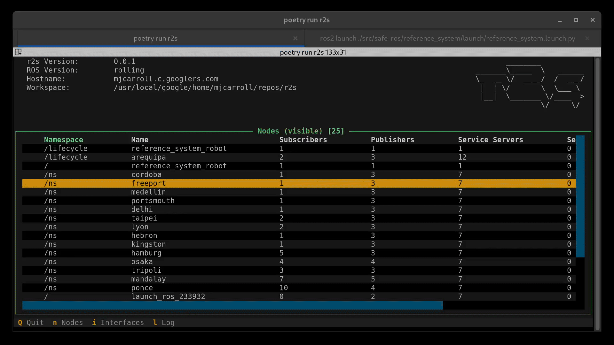

# r2s

r2s is a _Text User Interface_ (TUI) for interacting with various aspects of a ROS 2 system.
It is intended as a supplement to the [ros2cli](https://github.com/ros2/ros2cli) suite of command line tools.


r2s is written in Python and utilizes [Textual](https://github.com/textualize/textual/) for building the UI.




## Installing

To run:

```
git clone https://github.com/mjcarroll/r2s.git
cd r2s
poetry install
poetry run r2s
```

## Development

To run in development mode:

```
poetry shell
textual run --dev r2s.main:main
```

```
poetry shell
textual console
```

## Roadmap

Currently, there are 2 primary widgets for visualizing information in a grid or as a stream of text logs.

* ROS 2
  * Visualize stream of ROS messages in the text log view (ros2 topic echo)
  * Visualize stream of ROS logs from a node (rosconsole)
  * Visualize system load of individual nodes (requires instrumentation to associate PID with node)
  * Publish messages on a topic (ros2 topic pub)
  * Advance lifecycle node states (ros2 lifecycle)
  * Visualize message definitions (ros2 interface)
  * Call Services (ros2 service)
* Colcon
  * List packages in a workspace (colon list/colcon graph)
  * Select and build multiple packages
  * View package build logs
  * View test logs
* Gazebo
  * Visualize topics/nodes
  * Port ROS functionality to gz-transport and gz-msgs
